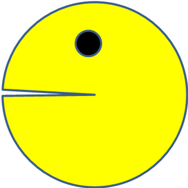

# PacMan Exercise
## Factory for making pacmen
This project use four images from an array and appends images using fumvtions to move the DOM in random directions, returning the object in the opposite direstion when it collides with the edge of the viewport.

## How to run the program
1. Press the Start Game button.
2. Add PacMen with the Add PacMan button

## Future uses

I think this would be useful in setting a dynamic background for a frontend design. I would like to experiment with multiple arrays and differing images in the future.

